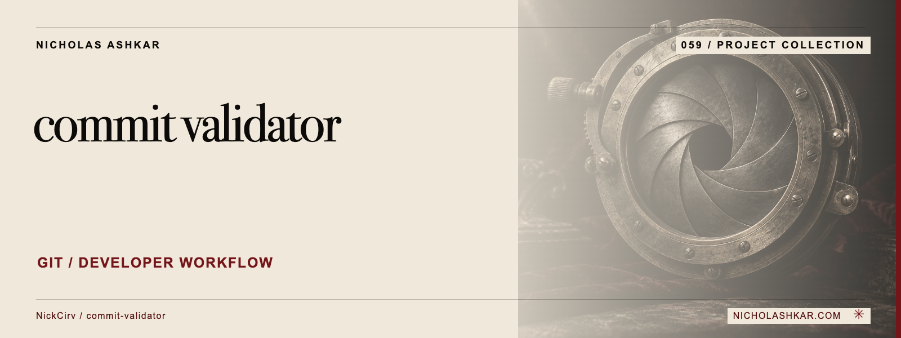

# commit-validator

Validates commit-message structure against configurable Conventional Commit rules.


<a id="usage"></a>

<a id="validate-a-message-string"></a>

<a id="validate-the-last-5-commits"></a>

<a id="validate-commits-on-current-branch-vs-main-github-actions"></a>

## What it does

- Message parsing.
- Configurable types/scopes.
- Git-range checks.
- Commit-msg hook support.


<a id="install"></a>

## Quickstart

Prerequisites: Node.js `>=20` and npm; Git is also used by the implementation. The checkout below pins the source used for this documentation.

```sh
git clone https://github.com/NickCirv/commit-validator.git
cd commit-validator
git checkout b768765794d86a72584f1f619b8ca8a6366cf068
node index.js --help
```

**Expected behavior (illustrative, not captured):** Displays message-input, history and hook options.

Examples are source-inspected, **not runtime-tested**. See the research record for verification gaps.

## Boundaries and data

A valid message does not verify the implementation or release classification. Installing/uninstalling a commit-msg hook changes repository behavior; inspect existing hooks first.

## Development

The manifest defines `npm test` as:

```sh
node --test
```

The captured suite is a smoke check, not end-to-end behavior coverage. Examples include “entry is valid JavaScript”. Tests were not run for this documentation revision.

See [implementation and command reference](docs/REFERENCE.md) for the package scripts and inspected interfaces, and [research record](docs/RESEARCH.md) for the pinned source, document decisions and unresolved checks.

## License and contact

See [LICENSE](LICENSE) for the original terms and attribution. Legal text is unchanged.

[Nicholas Ashkar](https://nicholashkar.com/) · [Discuss a project](https://nicholashkar.com/#oxblood-contact)
